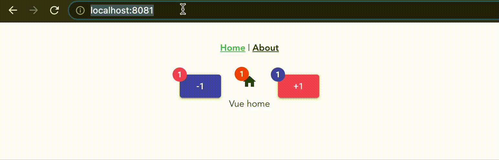

# Vue Router with federated Angular

There are 3 Angular components inside Vue app, all using Material design:

1. Button decrement
2. Button increment
3. Counter state with icon

Template looks like:

```html
<template>
  <div>
    <ng-btn-decrement />
    <ng-counter-state />
    <ng-btn-increment />
  </div>
</template>
```

> Every component injects counter service



<a id="ng-exporting-concept"></a>

## Main concept of exporting Angular Components

In order for the micro frontend application work correctly, you have to:

- Bootstrap Angular app one time;
- Use single Injector in all app.

Rules:

- We share and render `components`, **not** `modules`;
- It's better to define all Web Components inside bootstrap function then define new single item every time inside Vue app.

That is my [implementation](./angular-remote/apps/angular-app/src/remote-utils.ts) of bootstrap function:

```ts
// It defined in angular, just for reminder
interface NgModuleRef<T> {
  injector: Injector;
  componentFactoryResolver: ComponentFactoryResolver;
  onDestroy(callback: () => void): void;
  destroy(): void;
  instance: T;
}
```

```ts
let _ngModuleAppProvider: undefined | NgModuleRef<any>;

@NgModule({ imports: [BrowserModule] })
class EmptyModule implements DoBootstrap {
  ngDoBootstrap() {
    console.log('Bootstrapped ng app');
  }
}

export const bootstrapAngularApp = async (
  AngularModule: Type<any> = EmptyModule,
  afterNgAppInit: (props: NgModuleRef<any>) => void
) => {
  if (_ngModuleAppProvider) {
    throw new Error('Root module already exists');
  }

  if (environment.production) {
    enableProdMode();
  }

  const ngModuleRef = await platformBrowserDynamic().bootstrapModule(
    AngularModule
  );

  _ngModuleAppProvider = <NgModuleRef<any>>{
    ...ngModuleRef,
  };

  afterNgAppInit(_ngModuleProvider);
};
```

There are 2 functions implemented to render component. This is example of define Web Components (check how to render component by selector inside file):

```ts
export const defineAngularWebComponent = (
  AngularComponent: Type<any>,
  name: string
) => {
  if (!_ngModuleAppProvider) {
    throw new Error('No root module found');
  }

  const ngComponentConstructor = createCustomElement(AngularComponent, {
    injector: _ngModuleAppProvider?.injector,
  });
  customElements.define(name, ngComponentConstructor);

  return ngComponentConstructor;
};
```

Use Angular Web Components like default html tags:

```html
<div>
  <angular-style-provider />
  <router-view />
</div>
```

## Issues

- If you walk through Vue routes, `renderAngularComponent` function create component only first time when you visit Vue route. Use it in `updated` lifecycle hook might somehow fix this

## Vue setup from scratch

1. Init Vue with [Vue Router](https://router.vuejs.org/ru/).

2. [Configure webpack](../angular-react-vue/README.md) as you need.

- Don't use `publicPath` property inside `ModuleFederationPlugin` configuration or your routes will be broken:
  - Home - http://localhost:8081/http://localhost:8081/
  - About - http://localhost:8081/http://localhost:8081/about

3. Init Vue app after Angular app created:

`bootstrap.ts`

```ts
import { createApp } from 'vue';
import App from './App.vue';
import router from './router';

const initVue = () => {
  createApp(App).use(router).mount('#app');
};

//@ts-expect-error
import('angularApp/utils')
  .then(({ bootstrapAngularApp }) => bootstrapAngularApp())
  .then(initVue);
```

4. Import Angular styles-provider and connect it to the template:

```html
<template>
  <div>
    <angular-style-provider></angular-style-provider>
    <router-view />
  </div>
</template>

<script>
  import { defineComponent } from 'vue';

  const ngPromise = Promise.all([
    import('angularApp/utils'),
    import('angularApp/styles'),
  ]);

  ngPromise.then(
    ([{ defineAngularWebComponent }, { StylesProviderComponent }]) =>
      defineAngularWebComponent(
        StylesProviderComponent,
        'angular-style-provider'
      )
  );

  export default defineComponent({
    name: 'App',
  });
</script>
```

## Angular setup from scratch

1. Init Angular with [nx](https://nx.dev/) and [@angular/material](https://material.angular.io/).

2. [Configure webpack](../angular-react-vue/README.md) as you need.

3. For sharing global Angular styles, create [component](./angular-remote/libs/shared/styles-provider/src/lib/shared-styles.component.ts) with adding to new [shared-styles.css](./angular-remote/libs/shared/styles-provider/src/lib/shared-styles.scss) all css from html (in my case it was material):

`shared-styles.component.ts`

```ts
import { Component, ViewEncapsulation } from '@angular/core';

@Component({
  selector: 'angular-remote-styles-provider',
  styleUrls: ['./shared-styles.scss'],
  template: '',
  encapsulation: ViewEncapsulation.None,
})
export class StylesProviderComponent {}
```

`shared-styles.scss`

```scss
@use '~@angular/material' as mat;

// relocated from index.html
@import url('https://fonts.gstatic.com');
@import url('https://fonts.googleapis.com/css2?family=Roboto:wght@300;400;500&display=swap');
@import url('https://fonts.googleapis.com/icon?family=Material+Icons');

// ...
```

> This component must be inserted on page to bring styles to application

4. Create utils to insert Angular app inside Vue inside new [file](./angular-remote/apps/angular-app/src/remote-utils.ts). One way is define Web Component, so I used [@angular/elements](https://angular.io/guide/elements). Check concept [here](#ng-exporting-concept).

5. Export your libraries from Angular:

`webpack.config.js`

```ts
new ModuleFederationPlugin({
  //...
  exposes: {
    './styles': 'libs/shared/styles-provider/src/index',
    './utils': 'apps/angular-app/src/remote-utils',
  },
  //...
});
```

You may also need add path to `remote-utils.ts` your to `tsconfig.app.json`, if some error occur:

**If you exposes library that was never imported into your Angular app, Webpack will drop error**:

```bash
./libs/share/counter/src/index.ts - Error: Module build failed (from ./node_modules/@ngtools/webpack/src/ivy/index.js):
Error: /Users/name/Documents/work/micro-fe/my-mfe-examples/angular-in-vue-router/angular-remote/libs/share/counter/src/index.ts is missing from the TypeScript compilation. Please make sure it is in your tsconfig via the 'files' or 'include' property.
    at /Users/name/Documents/work/micro-fe/my-mfe-examples/angular-in-vue-router/angular-remote/node_modules/@ngtools/webpack/src/ivy/loader.js:59:26
    at processTicksAndRejections (internal/process/task_queues.js:95:5)
```

I found how to fix it, you might add to your sharing Angular app's [tsconfig.app.json](./angular-remote/apps/angular-app/tsconfig.app.json):

```json
  "files": [
    "src/main.ts",
    "src/polyfills.ts",
    "src/remote-utils.ts", // <-- single file
    "../../libs/shared/counter/src/index.ts" // <-- library
    "../../libs/shared/btn-increment/src/index.ts" // <-- 7th step
```
