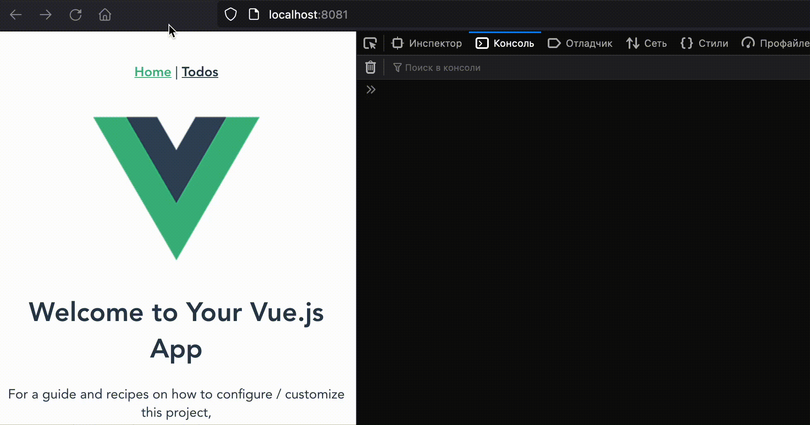

# WIP

☑️ concept approved

- check why `async` doesn't works if don't import to root module
- check why @ViewChild doesn't works if don't import to root module
- check why todos store doesn't works if don't import to root module

## Vue

1. init app

2. configure module federation

## Angular

1. init app

2. configure module federation

[Manually Lazy Load an Angular Module with ViewEngine and Ivy](https://juristr.com/blog/2019/10/lazyload-module-ivy-viewengine/)
