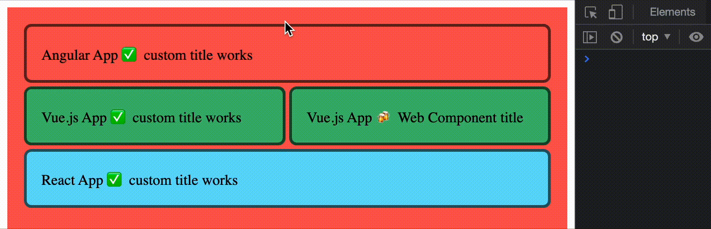

# Static Module Federation

Angular result example:



## Init

`application-name` = **angular-app | vue-app | react-app**

Repeat in 3 terminals:

`yarn`:

```bash
cd `application-name`
yarn
yarn serve
```

`npm`:

```bash
cd `application-name`
npm i
npm run serve
```

apps will be served on:

- Angular - http://localhost:4201/
- Vue - http://localhost:8081/
- React - http://localhost:3001/

---

## Conclusion

- React works very bad with imported Web Components, you can't listen custom events with `onEvent` template listeners. You can only use this way, but reactive prop re-render inside web component will be lost:

  only prop binding

  ```ts
  <vue-header title={wcTitle} />
  ```

  or eventListener with no reactivity

  ```ts
  const myEl = document.createElement('my-element');
  myEl.prop = 'hello';
  // or
  myEl.setAttribute('prop', 'hello');
  myEl.addEventListener('customEvent' func);
  ```

* Angular and Vue works nice with Web Components, there are easy ways to pass props and listen to events:

  Angular:

  ```html
  <vue-header [title]="wcTitle" (headerclick)="log($event)"></vue-header>
  ```

  Vue:

  ```html
  <ng-header :title="wcTitle" @headerclick="log($event)"></ng-header>
  ```

## Strange things / Unexpected behavior

- To create Angular Web Component, you must import `zone` inside [utils file](./angular-app/src/utils.ts).
- To render React Element, you must import `React` inside [utils file](./react-app/src/utils.tsx).
- [In Vue component](./vue-app/src/components/Header.vue), to use both `Web Components` and `native render` you must copy-paste your styles from \<style\> tag into styles[]

### Exporting elements with Module Federation to foreign framework:

✅ - Ok

⚠️ - Input prop can be set only when rendered first time

  <details>
  <summary>Vue:</summary>

| type           | Render | Input | Output |
| -------------- | ------ | ----- | ------ |
| Native         | ✅     | ⚠️    | ✅     |
| Web Components | ✅     | ✅    | ✅     |

  </details>

  <details>
  <summary>React</summary>

| type           | Render | Input | Output |
| -------------- | ------ | ----- | ------ |
| Native         | ✅     | ⚠️    | ✅     |
| Web Components | ❔     | ❔    | ❔     |

> Web Components from React seems to work ok, but it's tricky way to implement this

  </details>

  <details>
  <summary>Angular</summary>
  
| type           | Render | Input | Output |
| -------------- | ------ | ----- | ------ |
| Native         | ❔     | ❔    | ❔     |
| Web Components | ✅     | ✅    | ✅     |

  </details>

---

## How to implement

1.  Init apps

2.  Add some shared components

3.  Setup webpack

    Plugin config example:

    ```ts
    new ModuleFederationPlugin({
      name: 'vueApp',
      filename: 'remoteEntry.js',
      // elements that we importing
      remotes: {
        angularApp: 'angularApp@http://localhost:4201/remoteEntry.js',
        reactApp: 'reactApp@http://localhost:3001/remoteEntry.js',
      },
      // elements that we exporting
      exposes: {
        './Header': './src/components/Header',
        './utils': './src/utils',
      },
      shared: require('./package.json').dependencies,
    }),
    ```

    <details>
      <summary> 3.1 Angular: </summary>

    ```bash
    ng add @angular-architects/module-federation
    ```

    Select project if monorepo. All files will be created 😎, just edit [webpack.config.js](./angular-react-vue/angular-app/webpack.config.js) to configure [ModuleFederationPlugin](../README.md#plugin-config)
    </details>

    <details>
      <summary> 3.2 Vue: </summary>

    1. Install necessary packages

    ```bash

    yarn add webpack @vue/cli-plugin-babel@5.0.0-beta.2 @vue/cli-service@5.0.0-beta.2 -D

    ```

    or

    ```bash
    npm i webpack @vue/cli-plugin-babel@5.0.0-beta.2 @vue/cli-service@5.0.0-beta.2 -D
    ```

    2. Create [vue.config.js](./vue-app/src/vue.config.js) that exports [webpack configuration](https://cli.vuejs.org/guide/webpack.html) with [ModuleFederationPlugin setup](https://webpack.js.org/concepts/module-federation/#promise-based-dynamic-remotes)

    3. Create [asynchronous boundary](../README.md#asynchronous-boundary)

    </details>

    <details>

    <summary> 3.3 React: </summary>

    1.  Update necessary packages

    ```bash
    npm i -D webpack webpack-cli webpack-server html-webpack-plugin webpack-dev-server
    npm i -D bundle-loader babel-loader @babel/preset-react @babel/preset-typescript
    ```

    or

    ```bash
    yarn add -D webpack webpack-cli webpack-server html-webpack-plugin webpack-dev-server
    yarn add -D bundle-loader babel-loader @babel/preset-react @babel/preset-typescript
    ```

    2. Create [webpack.config.js](./react-app/src/webpack.config.js) with [ModuleFederationPlugin setup](https://webpack.js.org/concepts/module-federation/#promise-based-dynamic-remotes).

    3. Create [asynchronous boundary](../README.md#asynchronous-boundary)

    4. Add new scripts to your `package.json`

    ```json
    "scripts": {
      "serve": "webpack-cli serve",
      "build": "webpack --mode production",
      "serve-build": "serve dist -p 3001"
    },
    ```

    </details>

4.  Export components

      <details>
        <summary> 4.1 Angular: </summary>

    Using Web Components:

    1. Add [@angular/elements](https://angular.io/guide/elements)

    ```bash
    ng add @angular/elements
    ```

    2. Create exporting file like [utils.ts](./angular-app/src/utils.ts)

    3. Add your file to ts compilation

    if you use some utils file to define helper functions, make sure, that inside your [tsconfig.app.json](./angular-app/tsconfig.app.json) file added new `.ts` files to prevent error "{file} is missing from the TypeScript compilation":

    `tsconfig.app.json`

    ```json
    "files": [
      ...
      "src/utils.ts"
    ],
    ```

    4. Create empty module to define components by using `platformBrowserDynamic` fn

    ```ts
    @NgModule({ imports: [BrowserModule] })
    class EmptyModule implements DoBootstrap {
      ngDoBootstrap(appRef: ApplicationRef) {}
    }
    ```

    5. Export custom element define function

    ```ts
    export const defineAngularWebComponent = ({
      AngularComponent,
      name,
    }: {
      AngularComponent: Type<any>;
      name: string;
    }) => {
      platformBrowserDynamic()
        .bootstrapModule(EmptyModule)
        .then(({ injector }) => {
          const angularEl = createCustomElement(AngularComponent, { injector });
          customElements.define(name, angularEl);
        });
    };
    ```

    6. Pass `AngularComponent` and `tag-name` to `defineAngularWebComponent`. and use your `tag-name` inside html

      </details>
      <details>
        <summary> 4.2 Vue: </summary>

    Using Web Components:

    **If you want to use WC, your styles must be declared inside component styles array. [Example](./vue-app/src/components/Header.vue).**

    1. Inside [utils.js](./vue-app/src/utils.js) define function

    ```ts
    export const defineVueWebComponent = ({ VueElement, name }) => {
      const customEl = defineCustomElement(VueElement);
      customElements.define(name, customEl);
    };
    ```

    2. Pass `VueElement` and `tag-name` to `defineVueWebComponent`. And use your `tag-name` inside html

    ***

    Native:

    **If you want to use Native mounting, your styles must be declared inside \<style\> tag. [Example](./vue-app/src/components/Header.vue).**

    1. Inside [utils.js](./vue-app/src/utils.js) define function

    ```ts
    export const renderVueElement = ({ VueElement, selector, props }) => {
      const vueApp = createApp(VueElement, props);
      return { vueApp, vueEl: vueApp.mount(selector) };
    };
    ```

    > return only for get more flexability

    2. Pass `VueElement`, `DOM selector` and `props` to `renderVueElement`. It will be rendered inside `DOM selector`

    > also event listeners may be passed with converted name: `event-occurs` => `onEventOccurs`

      </details>

      <details>
        <summary> 4.3 React: </summary>

    1. Inside [utils.tsx](./react-app/src/utils.tsx) define function that uses `ReactDOM.render` fn

    ```ts
    ReactDOM.render(
      React.createElement(ReactElement, props),
      document.querySelector(selector)
    );
    ```

    2. Pass imported ReactElement, props, `DOM selector`

      </details>

5.  Import components

There are some ways to import federated modules:

```ts
import { Component } from 'someApp/Component';
```

or [Promise import() function](https://webpack.js.org/api/module-methods/#import-1)

```ts
import('someApp/Component').then(({ Component }) => {});

const { Component } = await import('someApp/Component');
```

Also `@angular-architects/module-federation` gives `loadRemoteEntry` and `loadRemoteModule` fns
